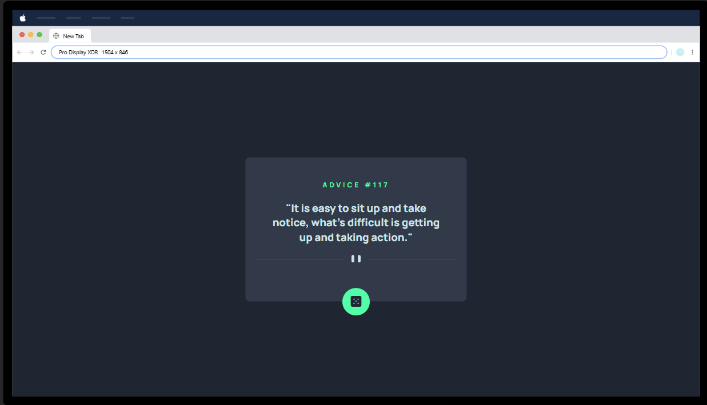

# Frontend Mentor - Desafio App Generador de Conselhos

Está é a solução para [ Desafio - App Gerador de Conselhos no Frontend Mentor](https://www.frontendmentor.io/challenges/advice-generator-app-QdUG-13db). Os desafios encontrados no Frontend Mentor, o ajudam a melhorar suas habilidades de codificação, construindo projetos realistas.

## Índice

- [Visão Geral](#overview)
  - [O Desafio](#the-challenge)
  - [Screenshot](#screenshot)
  - [Links](#links)
- [Meu processo](#my-process)
  - [Construído com](#built-with)
  - [O que eu aprendi](#what-i-learned)
  - [Desenvolvimento contínuo](#continued-development)
  - [Recursos úteis](#useful-resources)
- [Autor](#author)
- [Agradecimentos](#acknowledgments)


## Visão Geral

### O Desafio

- Construa um app gerador de conselhos com os designs fornecidos.

### Screenshot

Versão desktop:



Versão Mobile:


### Links


- DevQuest URL: [DevQuest](https://devemdobro.com/)
- Frontend Mentor URL: [Frontend Mentor](https://www.frontendmentor.io/challenges/advice-generator-app-QdUG-13db)
- Google Fontes URL: [Google Fontes](https://fonts.google.com/)

## Meu processo

### Construído com:

- HTML5  
- CSS 
- Flexbox


### Oque aprendi

Não houve a necessidade de utilizar a tag div, por ser um projeto básico, as tags tiverão classes bem definidas para facilmente serem estilizadas, criando assim um cartão através do Flexbox.

No posicionamento do botão na beira inferior do flexbox, apenas foi utilizado o  transform: translateY(85%); foi adicionado para centralizar o botão na tela usando o eixo Y. 

Também é possível fazer o mesmo utilizando o position, mas daria um pouco mais de trabalho.

Ao passar com o cursor sobre o botão terá  o efeito de sombreamento. Foi o resultado de empregar o :hover e o box-shadow.

```css
.card .botao:hover {
    color: #53FFAB;
    cursor: pointer;
    box-shadow: 0 5px 15px hsl(150, 100%, 66%);
    
}
```


### Desenvolvimento Contínuo 

Neste desafio, apenas foi aplicado o HTML e CSS básico. Sendo adicionado futuramente mais frases para a interatividade e o dinamismo com o JavaScript no app de gerador de conselhos.


### Recursos Úteis

- [Devemdobro](https://devemdobro.com/) - Atráves do curso DevQuest, estou aprendendo do zero sobre programação. 
- [Frontend Mentor](https://www.frontendmentor.com) - Nesta página podemos encontrar vários desafios, para aprimorar os conhecimentos.

## Autor

- GitHub - [LineFog](https://github.com/LineFog)
- Frontend Mentor - [@linefog](https://www.frontendmentor.io/profile/LineFog)


## Agradecimentos
Desafio aplicado no curso DevQuest da plataforma DevemDobro agradecendo pela didática das aulas aplicadas pelos professores Ricardo e Roberto.
Através da aula de reforço de CSS, pude compreender melhor a utilização do flexbox.


